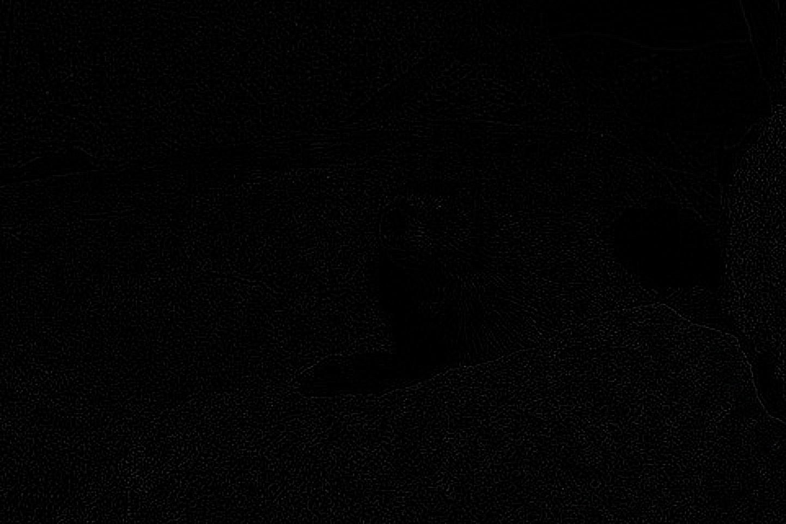

# Image Convolution: Performance Analysis

This C++ project implements and analyzes the performance of a convolution filter (Gaussian blur) applied to an image, comparing two different memory layouts: **AoS (Array of Structures)** and **SoA (Structure of Arrays)**.

The main goal is to measure sequential execution times on the CPU as the image dimensions scale up, pushing the hardware to its memory and cache limits.

## Image Elaboration 

<div align="center">
  
</div>
 
<table align="center">
  <tr>
    <td align="center">
      <br>
      <b>(a) Sharpen Filter</b>
    </td>
    <td align="center">
      <br>
      <b>(b) Edge Detection</b>
    </td>
  </tr>
  <tr>
    <td align="center">
      <br>
      <b>(c) Box Blur</b>
    </td>
    <td align="center">
      <br>
      <b>(d) Gaussian Blur</b>
    </td>
  </tr>
</table>

---

## Key Features

* **Dynamic Gaussian Filter:** Procedural generation of a normalized Gaussian kernel.
* **Flexible Filter Selection:** Choosing between different filters.
* **Spatial Stress Test:** The input image is progressively resized with multiplicative factors up to 100x.
* **Safe Memory Management:** Use of 64-bit addressing (`size_t`) to prevent index overflow when processing multi-gigabyte images.
* **Data Export:** Execution time results are saved in a CSV file, ready for plotting and statistical analysis.

---

## System Requirements

* **C++ Compiler:** Support for the C++17 standard or higher (e.g., GCC, Clang, MSVC).
* **OpenCV:** Library for basic image reading, manipulation, and resizing.
* **RAM:** At least 32 GB of memory is recommended to run the tests with `factor = 100` without triggering the OS OOM (Out Of Memory) Killer.
*  Otherwise you have to modifies the hardcoded array of resize factor.
*  Using WSL2 to execute the project or a Linux SO.

---

## Project Structure
* `main.cu`: Source code containing the parallel implementation of both layouts and the benchmark.
* `benchmark.cpp`: Source code containing the sequential implementation of both layouts and the benchmark.
* `experiments_results/`: Output directory (must be created before execution) where all the `performance_*.csv` file will be saved.
* `images`: Directory that contains the image template, the scaled input of this template and all the output with different filters applied.
* `reports`: Directory that contains some reports from the profiler.
* `analysis_plot`: Directory that contains all the plots generated from the `analysis_experiments.py` script.
* `CMakeLists.txt`: it contains directive for the compiler.
---

## Compilation and Execution

### Prerequisites
Ensure you have the **CUDA Toolkit** and **OpenCV** installed on your system. The code uses standard C++17 features (`std::filesystem`) to automatically manage output directories, so a compatible compiler is required.
As it is written in the CMakeList.txt it is used the optimized compilation for the sequential benchmark. 


### Compilation
The project uses CMake to manage dependencies and optimization flags automatically. 
To build the project in **Release** mode (optimized for performance):

```bash
mkdir build && cd build
cmake -DCMAKE_BUILD_TYPE=Release ..
make -j$(nproc)
```

### Execution
The implementation has three modes, and these are:
* Full Benchmark Suits (Default): to generates all the measures that will be saved in the folder "experiments_results"
  ```bash
  ./main_cuda
  ```
* Profile Mode: Runs a locked, heavy workload configuration (e.g., Factor 40, Filter 11x11, Block 16x16) designed specifically to be attached to NVIDIA profiling tools like Nsight Compute (ncu) or Nsight Systems (nsys).
  ```bash
  ./main_cuda profile
  ```
*  Visualization Mode: Executes a single, targeted convolution to visually inspect the correctness of some filters as: Gaussian blur. You can optionally specify a filter type.
    There are the four possible filters to call when using the ```bash ./main_cuda visualize *type_filter* ``` :
   - Edge Filter $\rightarrow$ edge 
   - Gaussian Filter $\rightarrow$ gaussian
   - Sharper Filter $\rightarrow$ default
   - Box Filter $\rightarrow$ box
 
### Plotting
After you have build and execute the benchmark sequential and parallel, you can plot all graphs after install requirements.txt.
```bash
  pip install -r requirements.txt
  python3 analysis_experiments.py
```
